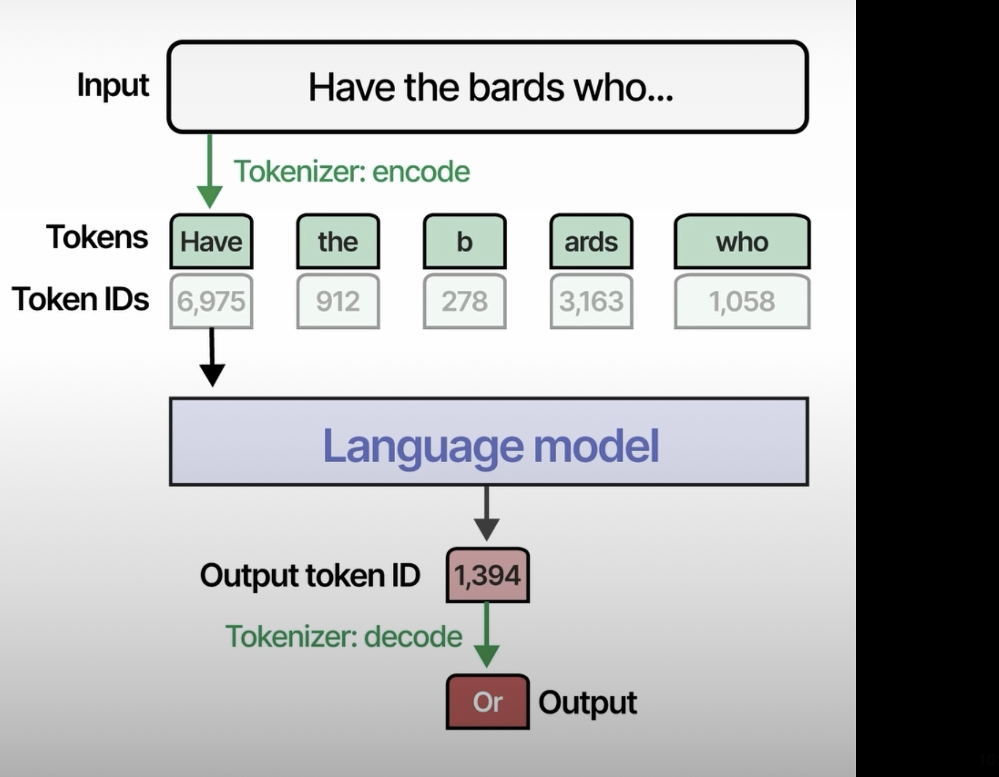

## The embedding process

- Embeddings generate values from -1 to 1 ever ?
- We split the words in tokens based on rules could be space or something defined. This process of break sentences in tokens is call tokenization.

After that we define each word with embedding. Each dimension of embeddings means something and add this word in a positoin in the vector like this images/embedding/images

- This is the process that we can use to make our word -> token -> embedding. The same process could happen with document or sentences

- The question is, how this embeddings are related with context ? 
- we have attention decoder or context embedding, the context embedding dind't work very well to good ammount of words, because it's too much context to only one embedding, for this reason have the attention context

#### Representation Models
- BERT is a representation Model that use a transform encoder

#### Generative Models

- How tokenizer works with generative Models

- The number of tokens and the way that this works depending of tokenizer that you use