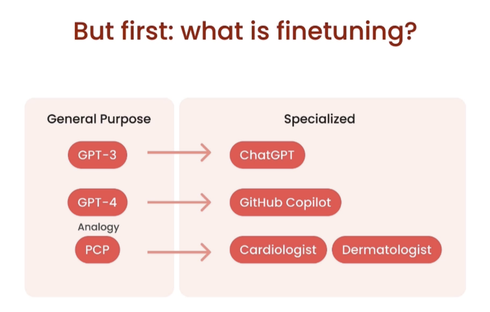
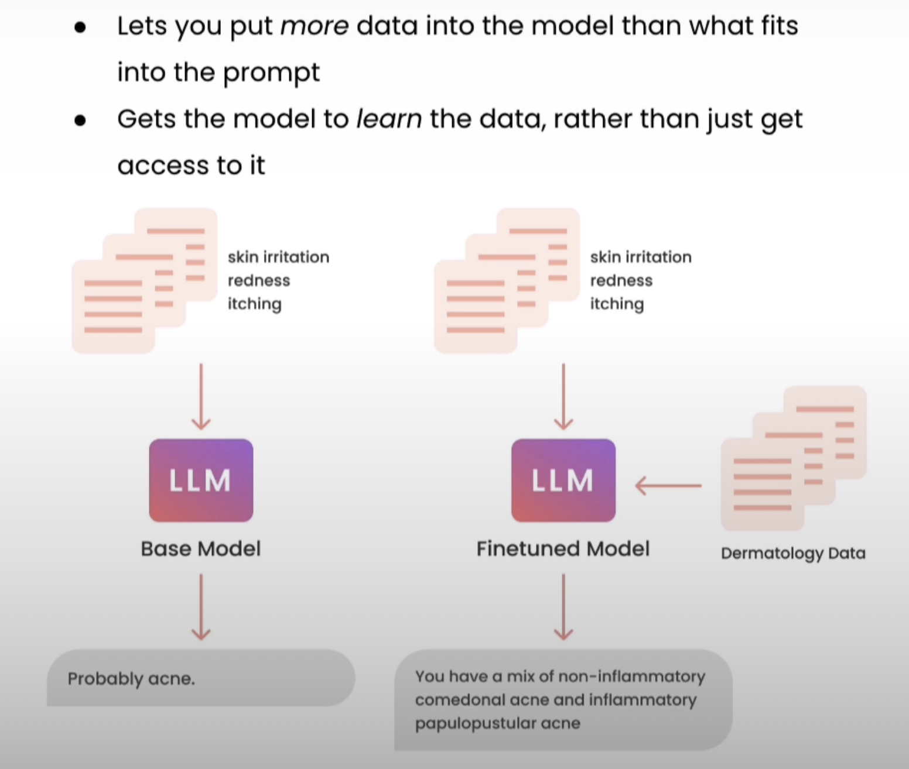
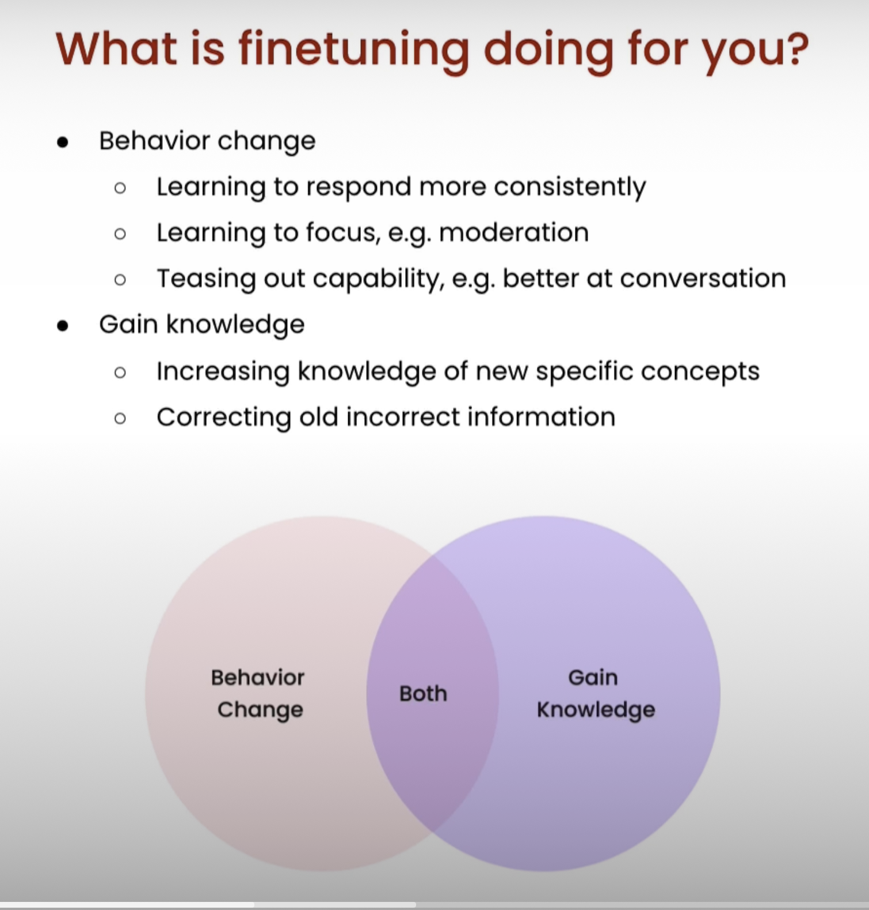
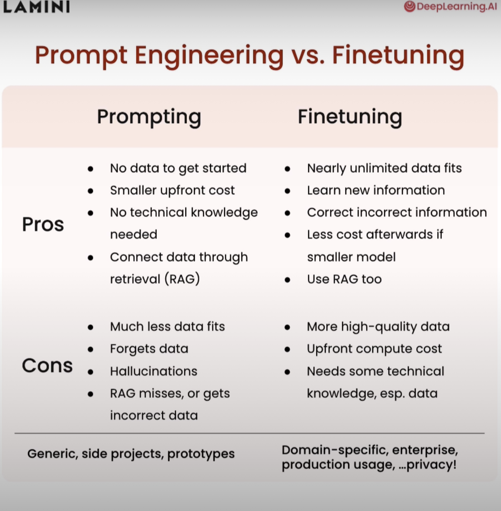
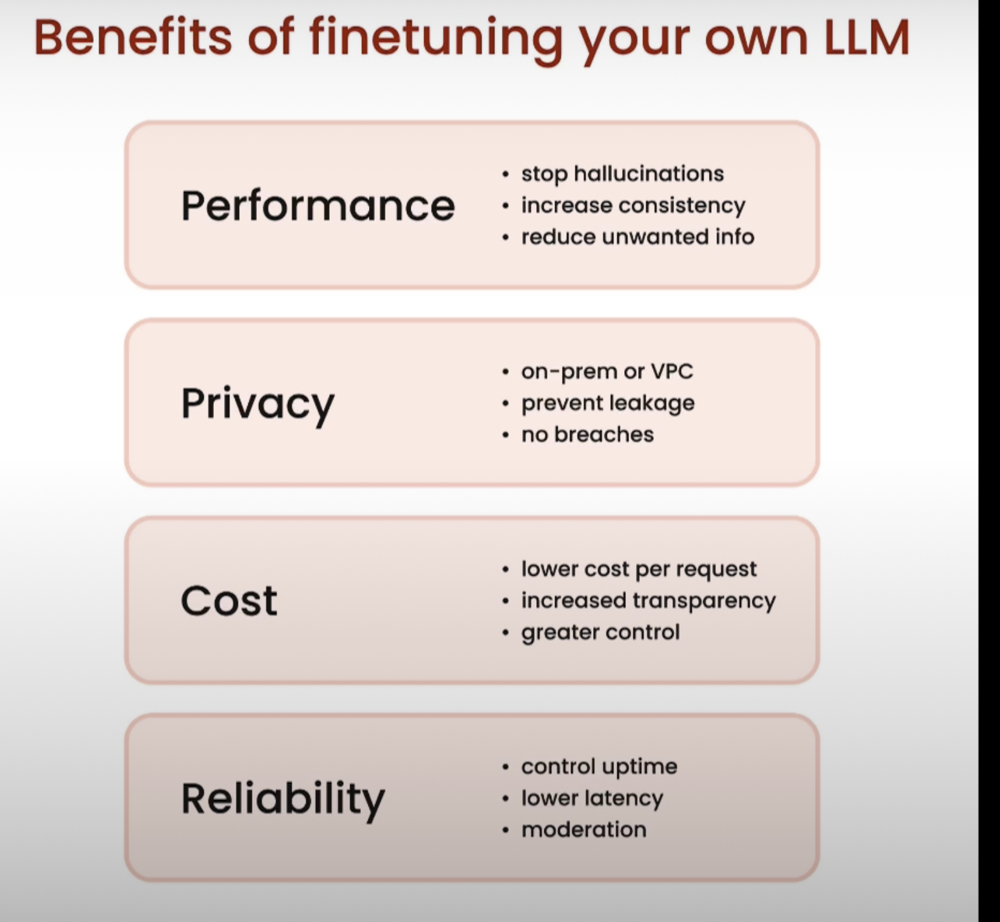
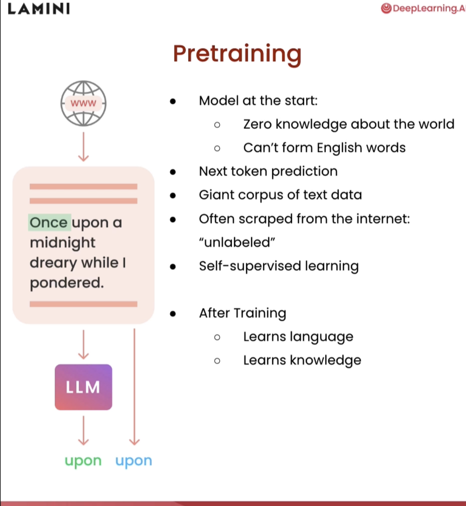
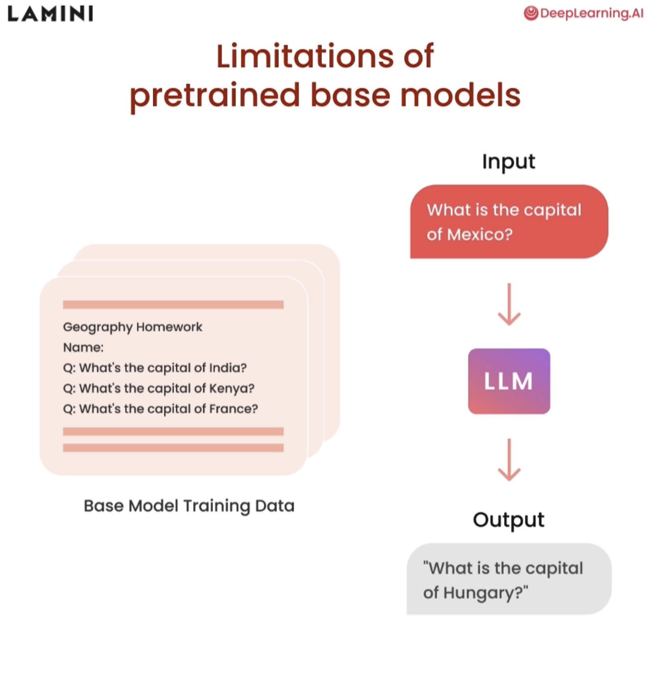
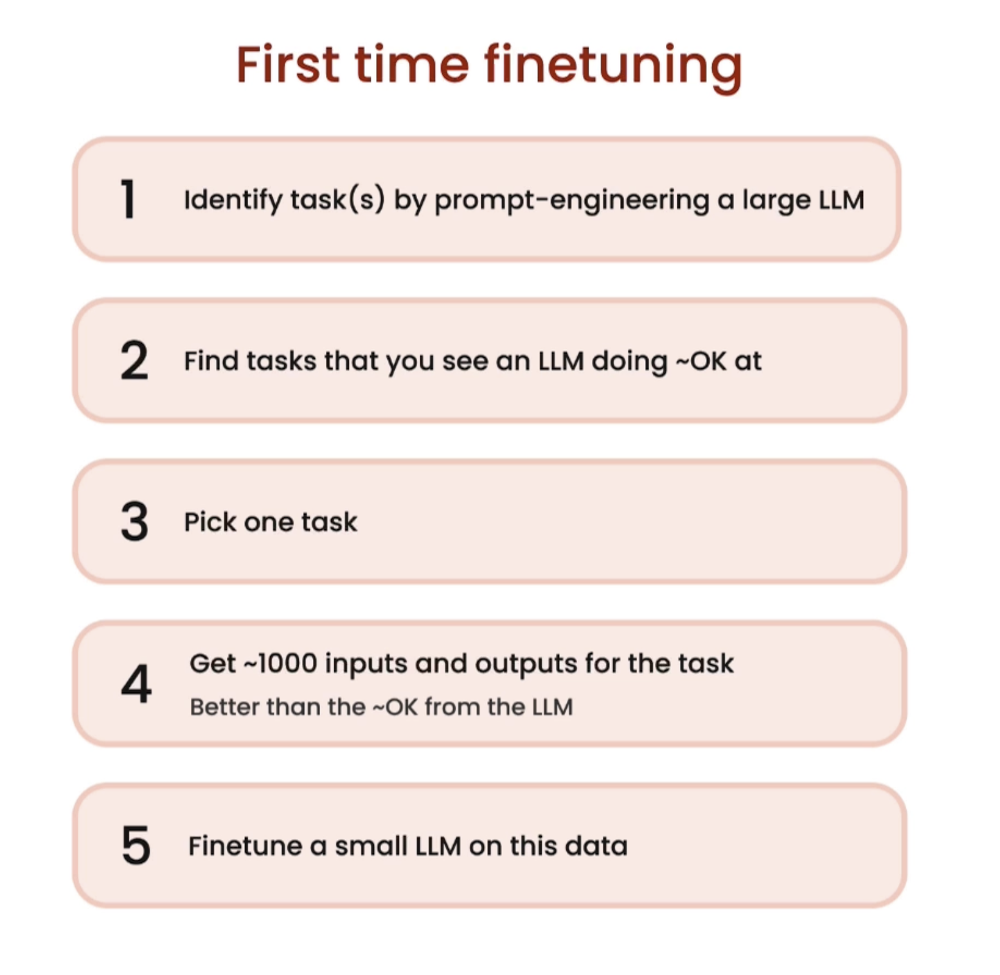

# Fine Tuning
## What is it ?
- Basically is get model that has general propose and strict them to specific propose

## What does ?
- Let you put more data into a model to learn with specific data. The next example will show about how the specific model can give you much more information and details

- Fine Tuning help to avoid hallucinations
## What ths pros and cons

## How train a model using fine tuning

## What I need to do to fine Tuning model?
