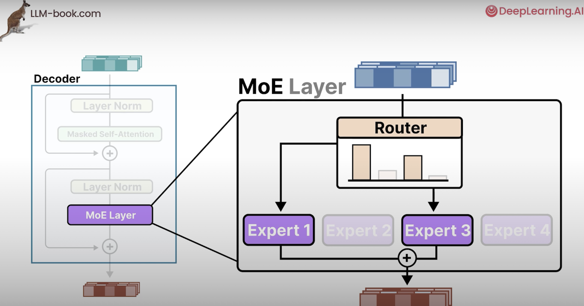
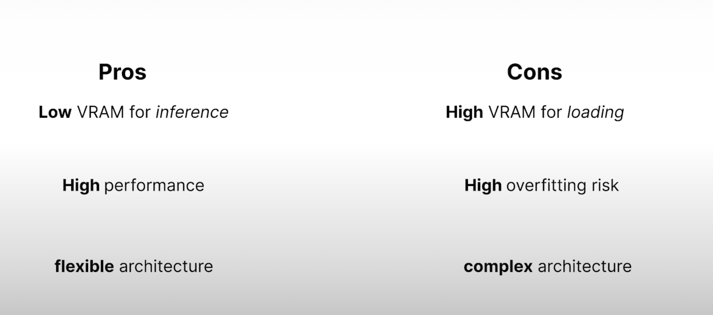

## LLM Structure

- The LLM receive a text input then go a transform LLM and then return output. To understand better check this images:

text input -> LLM transformer --> output

### Transformers blocks

- The transform block receive the embbeding of the input and return other embedding with the same number of dimensions that receive before and pass this new embedding to the trasnformers blocks n.
The transformer block has `Self-attention` and `Feed Forward Neural Network`

#### Feed Forward Neural Network
- It's basically a statisc prediction of what it's normally the best word statiscally to be the next one based on previous word. 

#### Self-attention
- It's responsible to validade and avaluete the context considering the previous tokens 

- To be more clear, the self-attention receive a embedding with the representation but will return this embedding with some changes based in the previous enbeddings

##### Relevance Scoring
- It's basically a calculation of Previous tokens and current tokens

- This will generate a new embeddig with context information

## Llamma 3 Model structure
- This images shows all the things that we saw until this moment to analyze a model

## Mixture of experts
- This is an onother approach that could be used, instead to have one `Feed Forward Neural Network` we have experts, the experts split this single `Feed Forward Neural Network` in othre networks with specialities like nouns, verbs, punctuation and etc

- This approach make only neural network that need to be activate be requested, this is called Sparse Model

- To understand what expert we will gona use we need another Neural Network called Router, it's a small Neural Network to route based in probabilty what expert this embedding should rederected

## Resources of model using as base Mixtral 8x7b

